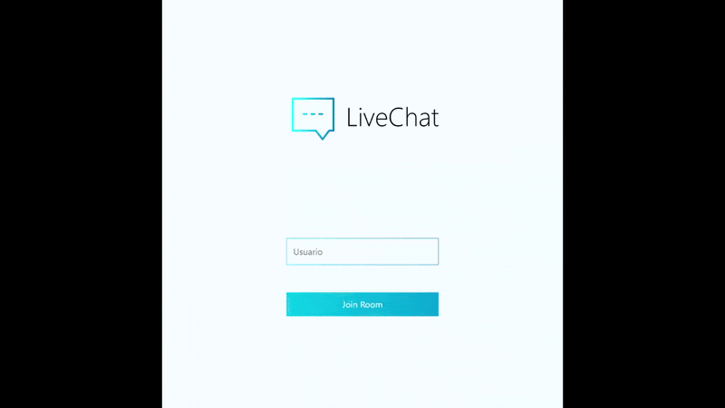

# 💬 LiveChat – Real-Time Messaging App

A real-time chat application built with Node.js, Socket.IO, and React.

---

## 🌍 Overview

LiveChat is a real-time chat system developed as part of a **1-day technical challenge for an interview.**

It consists of:

- **Backend:** Node.js + Socket.IO for WebSocket communication.
- **Frontend:** React (CRA) for user interface.

Users can create or join chat rooms by providing a room ID and then instantly exchange messages in real time.

---

## ✨ Features

- 🌐 Real-time messaging with Socket.IO
- 👥 Create or join chat rooms using an ID
- 💬 Multiple rooms supported simultaneously
- 🔄 Ephemeral storage (no database persistence)
- ⚡ Built in just 1 day as a coding challenge

---

## 📸 Showcase

### 🏠 Homepage



### 📱 Chat


---

## 🛠 Tech Stack

- **Backend:** Node.js, Express, Socket.IO
- **Frontend:** React (Create React App)
- **Others:** CORS, dotenv

---

## 📂 Project Structure

```text
LiveChat/
│
├── server/                 # Backend (Node.js + Socket.IO)
│   └── app.js
│
├── client/                 # Frontend (React - CRA)
│   ├── build/
│   ├── public/
│   └── src/
│       ├── App.js
│       ├── Chat.js
│       ├── Login.js
│       ├── Message.js
│       ├── index.js
│       ├── styles/
│       │   ├── Chat.css
│       │   ├── Login.css
│       │   └── index.css
│       └── assets/
│           └── logo.webp
│
└── README.md
```

---

## ⚙️ Installation & Setup

### Clone repo

```bash
git clone https://github.com/Fockus26/LiveChat.git
cd LiveChat
```

### Backend

```bash
cd server
npm install
npm start
```

### Frontend

```bash
cd client
npm install
npm start
```

### Environment Variables

Create a `.env` file inside `/server` with:

```env
PORT=3000
REACT_URL=http://localhost:3001
```

- **PORT** → Port where the backend runs
- **REACT_URL** → URL where the frontend is running or deployed

---

## 📖 Case Study

This project was built as part of a **1-day technical interview challenge.**

- **Challenge:** Build a real-time chat with support for multiple rooms.
- **Approach:** Used Socket.IO for WebSocket connections, React for a minimal frontend (Login, Chat, Message).
- **Constraints:** No database integration — messages are ephemeral.
- **Result:** A fully functional real-time chat delivered within the time limit, successfully passing the interview.

---

## 📈 Future Improvements

- 🗄️ Add database persistence (MongoDB, PostgreSQL)
- 🔐 Implement user authentication (JWT, OAuth)
- 📲 Add typing indicators & presence status
- 📷 Enable file/image sharing
- 📱 Improve and deploy a mobile-friendly UI
